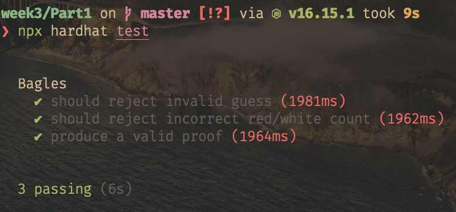
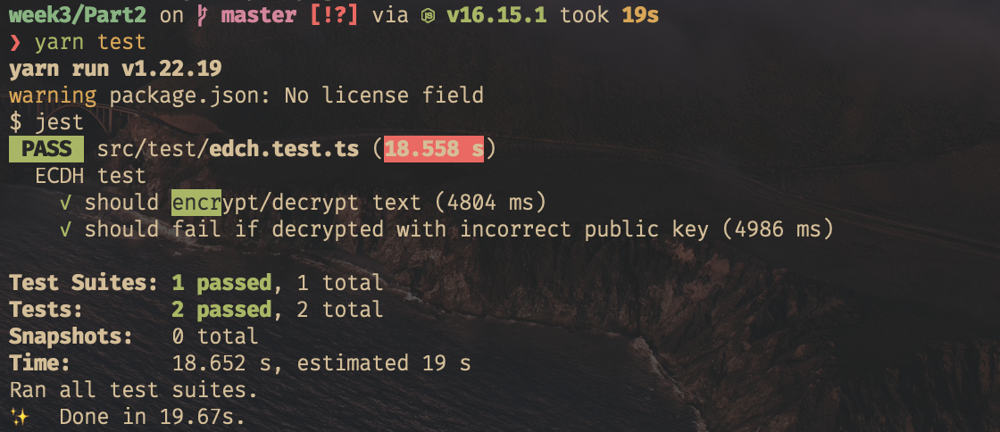

# ZKU week 3 solutions

`siosw#4738 - hi@simonoswald.xyz`

## part 1
**1** The private inputs include a salt value. The salt value is basically a randomly generated nonce provided by the player who is setting the code. The H(salt, soln[4]) is published before playing. The circuit is now verifying the solution agains that previously known hash. This makes bruteforcing much harder because the salt value must also be guessed correctly which increases the search space arbitrarily.

**3** 

**4** My game of choice would be a zk version of wordle. Alice sets a 4 letter word and Bob tries to guess it. Every guess needs to be a valid 4 letter word. If a letter in the guess is in the correct position it gets colored green. If it occurs in the hidden word but in a different spot, it is colored yellow. This could benefit from zk by allowing it to be decentralised, with different players setting the word to guess while still being resilient against cheating.
It can be implemented basically the same way as mastermind, with the red / white counters being replaced by the position of green and yellow markers. While the search space of all 4 letter strings is relatively large, the number of valid 4 letter words is easy to brute force. A salting mechansim will be used to hide the result. 

## part 2
**1.1** Multiple voters register to vote by sending their public key to a smart contract. A trusted coordinator and her public key are known to all voters. Voters can change their keys by sending an encrypted key-change message to the coordinator. Voters can vote by casting an encrypted vote signed with their current key.

**1.2** MACI aims to prevent collusion schemes where a dishonest party tries to influence the vote by paying voters to vote in a certain direction.

**1.3** Dishonest coordination between the voters is not something MACI can prevent. If an attacker can break the cryptographic primitives they can of course also manipulate the vote. If the coordinator is dishonest, collusion is possible, although the vote itself remains tamper proof.

**2.3** 

**3** The key idea here is that the final result of the VDF relies on the repeated squaring of the input value. This means that each compute heavy operation must be performed in sequence, since the results depend on each other.

## part 3
**1** Since the circuits are implemented I can generate the associated verifier contracts. Next I will implement an Auction smart contract that gets initialized (it might include a zk verification of the init) and accepts bids by accepting a zk proof of a valid bid + a fixed deposit. The Auction contract also is keeping track of the remaining auction time. Once the time is up it allows the winner to settle the auction (or forfeit the deposit). Other deposits are refunded. New auctions can be instatiated with a AuctionFactory contract that I will implement next. The last step will be building a web based frontend using react.

**2.1** zk-wordle 

  - wordle is a popular game where players need to guess a four letter word. Each guess needs to be a valid four letter word. The players receive hints after every guess, letters which are at the correct place get colored green, letters which occur in the solution, but at a different spot, are colored yellow. The player wins if they can guess the word in less than six tries.
  - This project can probably be approached very much like the Mastermind game. There would need to be a set of smart contracts that verify guesses, manage the rounds and possibly distribute prizes. I think the most interesting change a zk version would enable is that anyone can trustlessly set the new hidden word. Part of the project would be focused on exploring how this could change the game mechanics.
  - Since this is so close to the Mastermind variations I don't expect many unforeseen technical challenges. 

**2.2** zk-agar-io 

  - Agar-IO is a browser game where multiple players control a blob in a 2D world. While the original game involves a few fighting mechanics, this project would only focus on the movement aspect of the game. A new introduction would be a field of view, players can only see other players if they are close to them and have no other knowledge about their positions.
  - Dark Forest features a similar fog of war mechanic so looking at their design would be a good first step. I imagine players will submit zk proofs of their moves (every turn) to update their position. The challenge will be to share player positions if two player are within each others field of view.
  - The biggest technical challenge here, apart from the syncing player positions as mentioned above, will likely speed. The turns will ideally be fast enough to give the movement somewhat of real time feel. This will probably be infeasible but would be an interesting stress test of current on chain validation performance.

**2.3** zk-gate

  - NFTs are often used to token gate access to content / mints / events. Especially for IRL events this could be appealing if you don't want to link your on-chain ID with your physical identity. It would be nice to provide a service where users can prove that they control a private key of a wallet holding one (or more) of the tokens in question, without revealing the wallet or which exact token.
  - A semaphore would be the obvious choice for something like this. Users register there wallet holding the token into a smart contract by sending a signed message. We can then zk Proof that we indeed controll one of the registered wallets without revealing which one.
  - The main challenge I see here is that the smart contract will need to ensure that only wallets holding the token can register. It would be nice to allow the signed message (signed by the wallet holding the token) to be sent privately. There will also be edge cases to handle, such as what happens if the wallet stops holding the token while being registered.
